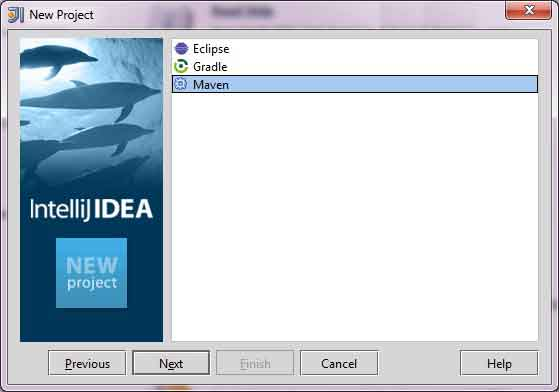
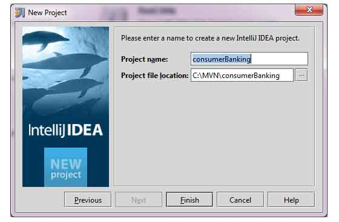

#<center> IntelliJ IDEA

IntelliJ IDEA 针对 Maven 支持内部构建功能。 在本例中，我们使用 IntelliJ IDEA Community Edition 11.1 的版本。

关于 IntelliJ IDEA 的一些特性如下：

- 可以通过 IntelliJ IDEA 来运行 Maven 目标。
- 可以在 IntelliJ IDEA 自己的终端里查看 Maven 命令的输出结果。
- 可以在 IDE 里更新 Maven 的依赖关系。
- 可以在 IntelliJ IDEA 中启动 Maven 的构建。
- IntelliJ IDEA 基于 Maven 的 pom.xml 来实现自动化管理依赖关系。
- IntelliJ IDEA 可以通过自己的工作区解决 Maven 的依赖问题，而无需安装到本地的 Maven 仓库，虽然需要依赖的工程在同一个工作区。
- IntelliJ IDEA 可以自动从远程 Moven 仓库上下载需要的依赖和源码。 
- IntelliJ IDEA 提供了创建 Maven 工程，pom.xml 文件的向导。 


下面的例子将会帮助你更加充分的认识集成的 IntelliJ IDEA 和 Maven 的优势。

## 在 IntelliJ IDEA 里创建一个新的工程
我们将会使用新建工程向导来导入一个 Maven 工程。

- 打开 IntelliJ IDEA.
- 选择 **File Menu > New Project** 选项。
- 选择 **import project from existing model** 选项。

<center>

</center>

- 选择 **Maven** 选项。
<center>

</center>

- 选择工程路径，即使用 Maven 创建一个工程时的存储路径。 假设我们创建了一个工程： consumerBanking. 通过 [**Maven - 创建工程**](maven-9-creating-project.md) 查看如何使用 Maven 创建一个工程。
<center>

</center>

- 选择要导入的 Maven 工程。
<center>

</center>

- 输入工程名称，点击 "finish".
<center>

</center>

目前为止，你已经可以在 IntelliJ IDEA 里看到 Maven 工程了。看一下 consumerBanking 工程的 Libraries 和 Test Libraries. 你可以发现 IntelliJ IDEA 已经将 Maven 所依赖的都添加到了它的构建路径里了。

<center>

</center>

## 在 IntelliJ IDEA 里构建一个 Maven 工程
好了，我们来使用 IntelliJ IDEA 的编译功能来构建这个 Maven 工程 。

- 选中 consumerBanking 工程。
- 选择 **Buid menu > Rebuild Project** 选项。

你可以在 IntelliJ IDEA 的终端里看到构建过程输出的log：

```
4:01:56 PM Compilation completed successfully
```

## 在 IntelliJ IDEA 里运行应用程序

- 选中 consumerBanking 工程。
- 右键点击 App.java 弹出上下文菜单。
- 选择 **Run App.main()** .
<center>

</center>

你将会在 IntelliJ IDEA 的终端下看到运行结果的输出。

```
"C:\Program Files\Java\jdk1.6.0_21\bin\java"
-Didea.launcher.port=7533 
"-Didea.launcher.bin.path=
C:\Program Files\JetBrains\IntelliJ IDEA Community Edition 11.1.2\bin"
-Dfile.encoding=UTF-8 
-classpath "C:\Program Files\Java\jdk1.6.0_21\jre\lib\charsets.jar;
C:\Program Files\Java\jdk1.6.0_21\jre\lib\deploy.jar;
C:\Program Files\Java\jdk1.6.0_21\jre\lib\javaws.jar;
C:\Program Files\Java\jdk1.6.0_21\jre\lib\jce.jar;
C:\Program Files\Java\jdk1.6.0_21\jre\lib\jsse.jar;
C:\Program Files\Java\jdk1.6.0_21\jre\lib\management-agent.jar;
C:\Program Files\Java\jdk1.6.0_21\jre\lib\plugin.jar;
C:\Program Files\Java\jdk1.6.0_21\jre\lib\resources.jar;
C:\Program Files\Java\jdk1.6.0_21\jre\lib\rt.jar;
C:\Program Files\Java\jdk1.6.0_21\jre\lib\ext\dnsns.jar;
C:\Program Files\Java\jdk1.6.0_21\jre\lib\ext\localedata.jar;
C:\Program Files\Java\jdk1.6.0_21\jre\lib\ext\sunjce_provider.jar;
C:\Program Files\Java\jdk1.6.0_21\jre\lib\ext\sunmscapi.jar;
C:\Program Files\Java\jdk1.6.0_21\jre\lib\ext\sunpkcs11.jar
C:\MVN\consumerBanking\target\classes;
C:\Program Files\JetBrains\
IntelliJ IDEA Community Edition 11.1.2\lib\idea_rt.jar" 
com.intellij.rt.execution.application.AppMain com.companyname.bank.App
Hello World!
Process finished with exit code 0
```